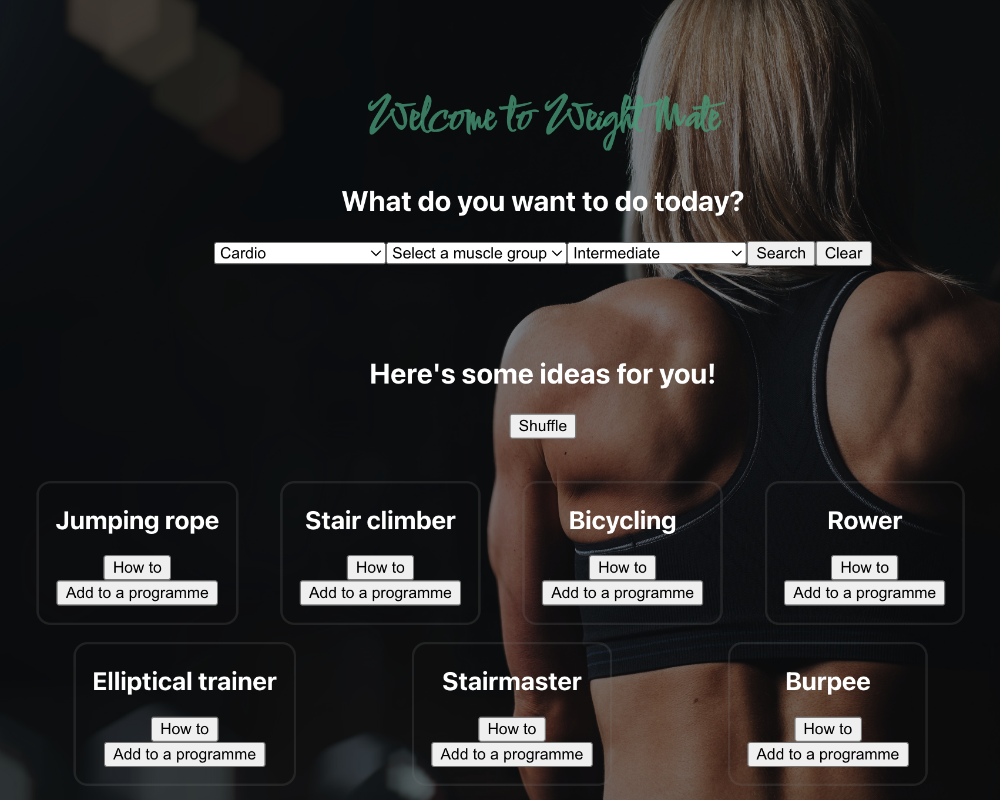

# Weight Mate

A novice gym user wants to track her weight training progress. She would like to be able to choose from a wide selection of exercises, have a resource to show her how to perform the chosen exercise, and also be able to record her performance so she can anaylize her progress. 
Ultimately, she'd like to use it on her phone at the gym, and make it part of her training routine. 

### Languages and Frameworks used:
JavaScript, React, CSS, JSX, Node, MongoBD

### Getting Started

This project was bootstrapped with [Create React App](https://github.com/facebook/create-react-app).

### Available Scripts

In the client directory, you can run:

### `npm i` 
Installs all dev dependancies.

### `npm start`

Runs the app in the development mode.\
Open [http://localhost:3000](http://localhost:3000) to view it in your browser.

The page will reload when you make changes.\
You may also see any lint errors in the console.

<!-- 

# Quiznet
### Wireframes
### Wireframe of main page

<!-- BACKGROUND -->

**Quiznet** is an application that aims to help programmers grow and maintain the wide range of information they need in a fun and as easy way. It can either be used with the premade questions, or JSON files of your own.

<!-- Hopefully there is a question or two in there that you didn't already know. If there's something that you'd recommend being added, please go to the [contribution](#contributing) section. -->

<!-- SCREENSHOT -->

<!--  -->

<!-- FEATURES -->

## Roadmap

- [ ] Start page
- [x] Questions for JavaScript and React.js
- [ ] Topic Selector
- [ ] Timer
- [ ] Results page with graphs
- [ ] Choose how many questions/topic
- [ ] Share results
- [ ] Fully tested
- [ ] Mobile responsive

See the [open issues](https://github.com/sf-adams/quiznet/issues) for a full list of proposed features (and known issues).

<!-- To view the demo: click here -->

<!-- GETTING STARTED -->

## Getting Started

The first step is to fork a copy of the Quiznet repository to your own account. Follow the [official instructions](https://docs.github.com/en/get-started/quickstart/fork-a-repo) from GitHub.

After completing that step, in the command line:

1. Clone your new repo by typing `git clone https://github.com/YOUR-USERNAME/quiznet.git`
2. Then type `cd quiznet` to go into the project's directory
3. Install the dependencies with `npm install`
4. Run the project with `npm start`
5. Quiz time!

<!-- AUTHOR/CONTACT -->

## Author

[![Website][website-shield]][website-url]
[![LinkedIn][linkedin-shield]][linkedin-url]
[![Medium][medium-shield]][medium-url]
[![Codepen][codepen-shield]][codepen-url]
[![GitHub][github-shield]][github-url]

[website-shield]: https://img.shields.io/badge/Sam%20Adams-FFD300?style=for-the-badge&logo=aboutdotme&logoColor=242424
[website-url]: https://sf-adams.com
[linkedin-shield]: https://img.shields.io/badge/LinkedIn-FFD300?style=for-the-badge&logo=linkedin&logoColor=242424
[linkedin-url]: https://linkedin.com/in/sf-adams
[medium-shield]: https://img.shields.io/badge/Medium-FFD300?style=for-the-badge&logo=medium&logoColor=242424
[medium-url]: https://medium.com/@sf-adams
[codepen-shield]: https://img.shields.io/badge/CodePen-FFD300?style=for-the-badge&logo=codepen&logoColor=242424
[codepen-url]: https://codepen.io/sf-adams
[github-shield]: https://img.shields.io/badge/GitHub-FFD300?style=for-the-badge&logo=github&logoColor=242424
[github-url]: https://github.io/sf-adams

<!-- LICENSE -->

## License

This project is licensed under the MIT License - see the [LICENSE.md](LICENSE.md) file for details

<!-- ACKNOWLEDGMENTS -->

## Acknowledgements

This project was inspired by [PassMedicine](https://www.passmedicine.com/) a resource that is used by thousands of medical students from across the United Kingdom. If it could work for them, then hopefully something similar would work for developers.

Other inspiration and references include:

- [FreeCodeCamp Developer Quiz](https://developerquiz.org/)
- [Dribbble Quiz Design](https://dribbble.com/shots/17815087-Audible-Utility-Quiz)

(<a href="#readme-top">Back to Top</a>)
 -->
