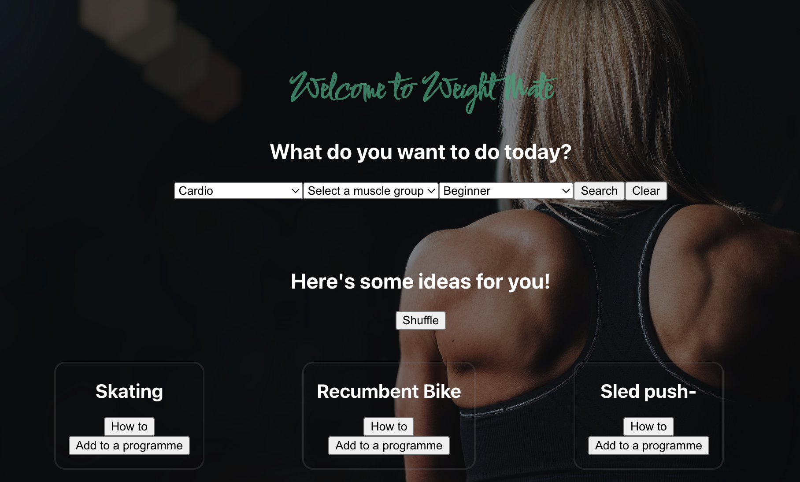

# Weight Mate

**Weight Mate** allows a novice gym user to track her weight training progress. She would like to be able to choose from a wide selection of exercises, have a resource to show her how to perform the chosen exercise, and also be able to record her performance so she can anaylize her progress. Ultimately, she'd like to use it on her phone at the gym, and make it part of her training routine. 

## Getting Started

The first step is to fork a copy of the Weight Mate repository to your own account. Follow the [official instructions](https://docs.github.com/en/get-started/quickstart/fork-a-repo) from GitHub.

After completing that step, in the command line:

1. Clone your new repo by typing `git clone git@github.com:ColetteDufficy/weight_mate_app.git`

2. You'll need to seed your database:
    - Type `cd server`
    - Type `npm run seeds`
3. Install the dependencies with `npm i`

4. You'll need to create an API key:
    - In your browser, navigate to `https://api-ninjas.com/api/exercises`. Create an account and an API Key.
    - In the command line, type `cd client/src`. Then type `touch env.js`
    - Enter the following code, save and close:
        `export const PORT = 3000`
        `export const DATABASE_URL="mongodb://localhost:27017"`
        `export const API_KEY="enter_your_API_key_here"`

5. You'll need to start your front end:
    - Type `cd client`
    - Install the dependencies with `npm i`

6. Run the project with `npm start`

Runs the app in the development mode.\
Open [http://localhost:3000](http://localhost:3000) to view it in your browser.

The page will reload when you make changes.\
You may also see any lint errors in the console.

This project was bootstrapped with [Create React App](https://github.com/facebook/create-react-app).

## Author

[![Website][website-shield]][linkedin-url]
[![LinkedIn][linkedin-shield]][linkedin-url]
[![GitHub][github-shield]][github-url]

[website-shield]: https://img.shields.io/badge/Colette%20Dufficy-FFD300?style=for-the-badge&logo=aboutdotme&logoColor=242424
[linkedin-shield]: https://img.shields.io/badge/LinkedIn-FFD300?style=for-the-badge&logo=linkedin&logoColor=242424
[linkedin-url]: https://linkedin.com/in/colettedufficy/
[github-shield]: https://img.shields.io/badge/GitHub-FFD300?style=for-the-badge&logo=github&logoColor=242424
[github-url]: https://github.com/ColetteDufficy

<!-- LICENSE -->

## License

This project is licensed under the MIT License - see the [LICENSE.md](LICENSE.md) file for details

(<a href="#readme-top">Back to Top</a>)
 

